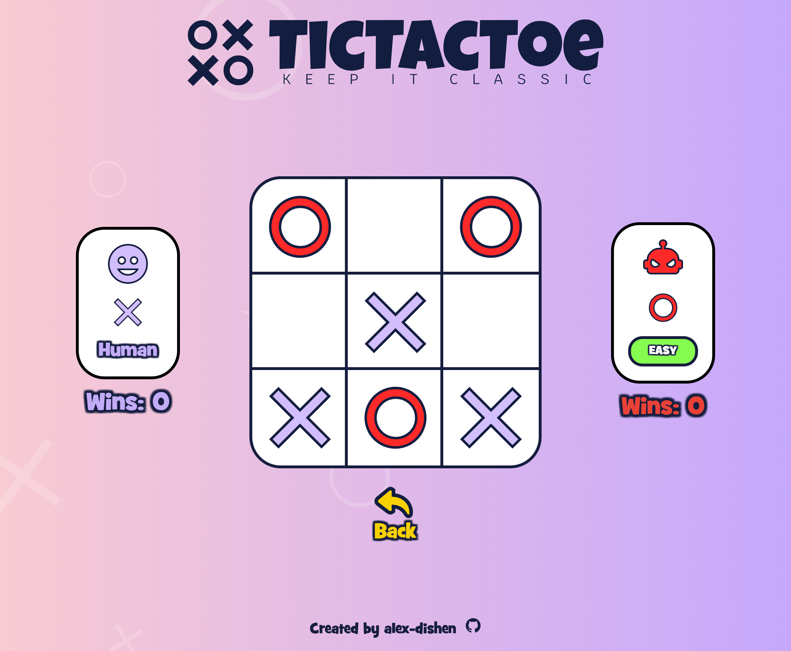

# Tic Tac Toe
The **Library** project is created according to the assignment from **The Odin Project** [course](https://www.theodinproject.com/paths/full-stack-javascript/courses/javascript).
 
 

### 🔗 **Live preview** of the project is [here](https://alex-dishen.github.io/tic-tac-toe/).

## **Features**
* Two players mode
* AI mode
* Ability to change level of difficulty of the AI
## In progress:
* Middle level of difficulty
* Hard level of difficulty

## **Outcome**
* Used **HTML**
* Used **CSS**
* Used **JavaScript**
* Learned how to tackle all items inside functions to free global scope
* Improved usage of factory functions
* Improved usage of module pattern
* Usage of minimax algorithm

## **Navigation**
* See my next project [CV Maker](https://github.com/alex-dishen/cv-maker)
* See my previous project [Library](https://github.com/alex-dishen/library)